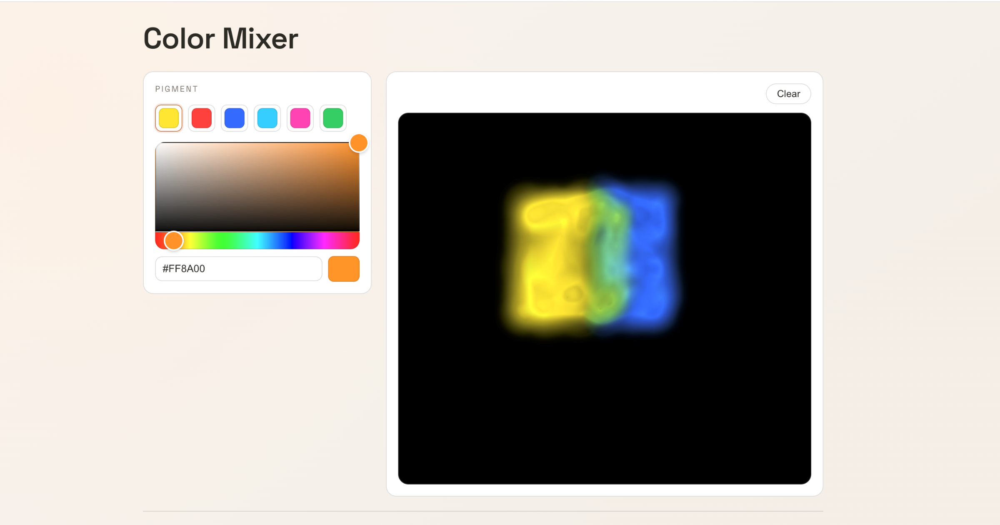

# [Color Mixer](https://blode.co/color-mixer)

**Paint with real pigments in the browser, mixed by [Mixbox](https://github.com/scrtwpns/mixbox) on a WebGPU fluid canvas**

Pick a pigment, drag across the canvas, and watch the paint flow and blend the way wet paint does.

  

## Demo

Blue over yellow gives you green here, not the grey an RGB blend would give you.

## What you can do

- **Choose a pigment:** 11 real paints, from Cadmium Yellow to Phthalo Blue and Titanium White, or mix your own with the hex picker.
- **Paint or smudge:** press and drag to inject pigment into the fluid, or switch to Smudge to push what is already there.
- **Set the brush:** adjust radius and flow to lay down a hairline or a loaded stroke.
- **Watch it mix subtractively:** pigment advects and diffuses every frame through Mixbox, so overlapping colors combine like paint rather than light.
- **Undo, redo, or clear:** `Cmd+Z` and `Cmd+Shift+Z` step through strokes, and Clear resets the canvas.

## Requirements

WebGPU, available in recent desktop Chrome, Edge, and Safari. If it is not enabled the app says so and links the setup docs. Everything runs locally in your browser.

## License

This project's own code is [MIT](./LICENSE).

It depends on Mixbox, which is © Secret Weapons and licensed under [CC BY-NC 4.0](https://creativecommons.org/licenses/by-nc/4.0/), so the project as a whole is for non-commercial use only. The MIT license on this code grants no commercial rights to Mixbox; for that, obtain a commercial license from Secret Weapons. See [NOTICE](./NOTICE).

---

Crafted by  [Matthew Blode](https://blode.co)
